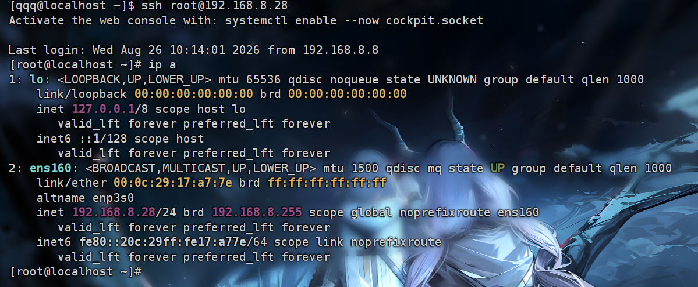

## Ansible 是什么

Ansible 是一个无代理的自动化运维工具，主要通过 SSH 连接目标主机，再使用模块完成软件安装、文件复制、服务管理和配置下发。控制节点只需要安装 Ansible，目标主机通常只需要提供 SSH 和 Python 环境。

本文记录从 CentOS Stream 9 环境准备，到 Ad-hoc 命令和 Playbook 的完整入门过程。

## 换源与安装

开始前先确认网络和 DNS 正常：

```bash
ping -c 3 8.8.8.8
nslookup mirrors.aliyun.com
```

将 CentOS Stream 的软件源切换为阿里云镜像：

```bash
sudo tee /etc/yum.repos.d/centos.repo > /dev/null << 'EOF'
[baseos]
name=CentOS Stream $releasever - BaseOS
baseurl=https://mirrors.aliyun.com/centos-stream/$releasever-stream/BaseOS/$basearch/os/
gpgkey=file:///etc/pki/rpm-gpg/RPM-GPG-KEY-centosofficial
gpgcheck=1
repo_gpgcheck=0
metadata_expire=6h
enabled=1

[appstream]
name=CentOS Stream $releasever - AppStream
baseurl=https://mirrors.aliyun.com/centos-stream/$releasever-stream/AppStream/$basearch/os/
gpgkey=file:///etc/pki/rpm-gpg/RPM-GPG-KEY-centosofficial
gpgcheck=1
repo_gpgcheck=0
metadata_expire=6h
enabled=1

[crb]
name=CentOS Stream $releasever - CRB
baseurl=https://mirrors.aliyun.com/centos-stream/$releasever-stream/CRB/$basearch/os/
gpgkey=file:///etc/pki/rpm-gpg/RPM-GPG-KEY-centosofficial
gpgcheck=1
repo_gpgcheck=0
metadata_expire=6h
enabled=1
EOF
```

清理旧缓存并重建：

```bash
sudo dnf clean all
sudo rm -rf /var/cache/dnf/*
sudo dnf makecache
```

在控制节点安装 EPEL 和 Ansible：

```bash
sudo dnf install -y epel-release
sudo dnf install -y ansible
```

## 配置 SSH 免密登录

生成密钥：

```bash
ssh-keygen
```

一路按回车即可。将公钥复制到目标主机：

```bash
ssh-copy-id 用户名@IP
```

第一次连接需要确认主机指纹，之后可以直接测试：

```bash
ssh 用户名@IP
```



## inventory 主机清单

创建 `inventory.ini`，把目标主机放入分组：

```ini
[testservers]
192.168.8.28 ansible_user=root
192.168.8.38 ansible_user=root

[test]
192.168.8.28
192.168.8.38

[test:vars]
ansible_user=root
ansible_ssh_common_args=-o StrictHostKeyChecking=no
```

主机地址后可以设置 `ansible_user`，指定 Ansible 登录目标主机时使用的账号。

### 普通用户执行 sudo 的问题

如果使用普通用户 `qqq` 生成密钥，私钥默认在 `/home/qqq/.ssh/id_rsa`。使用 `sudo ansible` 时，Ansible 会切换到 root 的环境，并尝试从 `/root/.ssh` 查找私钥，可能导致认证失败。

此时可以不使用 sudo 执行 Ansible，并在 inventory 中明确指定远程登录用户：

```ini
192.168.8.28 ansible_user=root
```

如果需要更易读的主机名，也可以在 `/etc/hosts` 中建立映射：

```text
192.168.1.1 r1
```

之后在 inventory 中直接使用 `r1`。

## 第一次连通性测试

在 inventory 所在目录执行：

```bash
ansible all -i inventory.ini -m ping
```

成功时会看到类似结果：

```text
192.168.8.28 | SUCCESS => {
    "changed": false,
    "ping": "pong"
}
192.168.8.38 | SUCCESS => {
    "changed": false,
    "ping": "pong"
}
```

## Ad-hoc 命令

基础语法：

```text
ansible <主机组> -m <模块名> -a "<模块参数>"
```

Ansible 具有幂等性：目标主机已经满足要求时，重复执行通常不会产生改变，并会返回 `changed: false`。

### command 与 shell

`command` 适合执行普通命令，不支持管道和重定向；`shell` 通过 Shell 执行，支持 `|`、`>` 和 `<`。

```bash
ansible all -i inventory.ini -m command -a "uptime"
```

### copy 模块

```bash
ansible all -i inventory.ini -m copy -a "src=~/qwq dest=~"
```

### dnf 模块

`state` 常用值包括：`present` 确保已安装、`latest` 安装最新版、`absent` 卸载软件。

```bash
ansible all -i inventory.ini -m dnf -a "name=nginx state=present"
```

### service 模块

`state` 可以是 `started`、`stopped`、`restarted` 或 `reloaded`，`enabled` 控制是否开机自启：

```bash
ansible all -i inventory.ini -m service -a "name=nginx state=started enabled=yes"
```

## Playbook

Playbook 使用 YAML 描述一组可重复执行的任务。注意两个空格缩进，冒号后保留空格，列表项使用 `- `：

```yaml
---
- name: 部署 nginx
  hosts: all
  tasks:
    - name: 安装 nginx
      dnf:
        name: nginx
        state: present
    - name: 启动并设置开机自启
      service:
        name: nginx
        state: started
        enabled: true
```

执行 Playbook：

```bash
ansible-playbook -i inventory.ini test.yml
```

使用 `-C` 可以先进行检查模式运行，不真正修改目标主机：

```bash
ansible-playbook -i inventory.ini test.yml -C
```

## Facts、变量与 register

Ansible 会在任务开始前收集目标主机的 Facts，可以通过变量访问主机名、发行版和 IP 等信息：

```text
{{ ansible_hostname }}
{{ ansible_distribution }}
{{ ansible_default_ipv4.address }}
```

`register` 可以接收命令结果，`debug` 再输出完整对象或其中的字段：

```yaml
- name: 查询当前目录
  command: pwd
  register: current_path

- name: 打印命令结果
  debug:
    msg: "{{ current_path.stdout }}"
```

## template 动态模板

创建 `uwu.j2`：

```text
这个设备是: {{ ansible_hostname }}
操作系统: {{ ansible_distribution }}
ipv4: {{ ansible_default_ipv4.address }}
```

Playbook 中使用 `template` 将模板渲染后发送到目标主机：

```yaml
- name: 生成主机信息文件
  template:
    src: ./uwu.j2
    dest: /root/uwu.txt
```

## 完整实验 Playbook

下面的 Playbook 会安装并启动 Nginx，查询磁盘状态，生成动态模板，再把结果打印出来：

```yaml
---
- name: 部署 nginx
  hosts: all
  tasks:
    - name: 安装 nginx
      dnf:
        name: nginx
        state: present

    - name: 启动并设置开机自启
      service:
        name: nginx
        state: started
        enabled: true

    - name: 查询磁盘状态
      command: df -h
      register: disk_status

    - name: 打印磁盘状态
      debug:
        msg: "{{ disk_status.stdout_lines }}"

    - name: 生成动态模板
      template:
        src: ./uwu.j2
        dest: /root/uwu.txt

    - name: 读取模板文件
      command: cat /root/uwu.txt
      register: rendered_file

    - name: 打印模板内容
      debug:
        msg: "{{ rendered_file.stdout_lines }}"
```

通过这次实验，可以把 Ansible 的基本工作链路串起来：inventory 定义目标主机，模块负责具体操作，Facts 和变量提供主机信息，register 保存任务结果，template 则负责生成动态配置文件。
