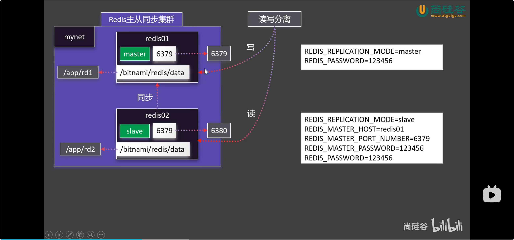
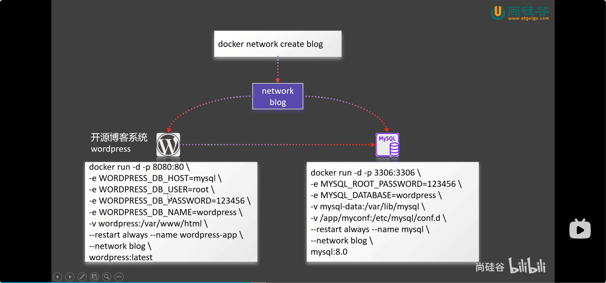
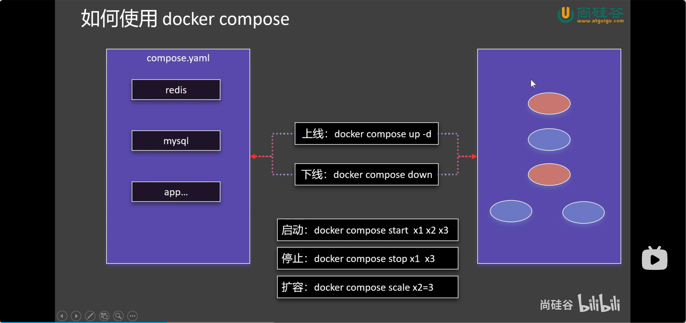

## Docker基础命令

### 对于镜像：

```

搜索:
docker search

下载:
docker pull

已安装列表:
docker images

删除:
docker rmi

```

### 对于容器:
```

查看：
docker ps 

删除：
docker rm

停止：
docker stop

启动：
docker start 

日志：
docker logs

运行：
docker run      -d  (后台运行)  --name(命名)  -p （映射端口 主:容器）	-e    (环境变量)

进入容器：
dokcer exec	-it (交互)	(name)	/bin/bash              

exit (退出)

```

### 保存&发布镜像
```
提交容器生成镜像：
docker commit	-a （提交的镜像作者）     -m  (提交时的说明文字)   <名或id>   < 命名:标签 >

离线：

    保存：
    docker save 	-o  (命名)	<镜像名>

    加载：
    docker load	-i  (压缩包文件路径)

在线：
    登陆：
    docker login < username / mail >

    命名：
    docker tag  <镜像名>	<用户名/镜像名>  （latest）

    推送发布：
    docker push

```

### 挂载

```

docker run 	-v	< 主机目录 >：< 容器目录 > 	**目录挂载**

docker run 	-v	< 卷名（没有 / & . 的纯名称） >：< 容器目录 > 	**卷映射**

docker <container> inspect  <   >   	查看容器具体信息，docker内网....

```

*挂的卷在：/var/lib/docker/volumes/*	

*docker volume ls 	查看创建的卷*

*docker volume  inspect  <   >	看卷的具体信息*

**注意：在run后的容器不能用命令追加挂载**

### 自定义docker内网：   （可以直接用容器名来进行连接，容器名=ip=域名）

```
docker network create  <网络名>

docker network ls 	查看网络

docker run	--network   < 网络名 >    应用

```

## 配置redis的主从机同步

**这是以配置环境变量来实现主从机同步的功能****



### 先去dockerhub里找到合适的镜像

https://hub.docker.com/r/bitnami/redis

### 先得创建个的自定义网络（方便后面直接用容器名来代替ip）：

```
docker network create  <自定义网络名>
```

**这里我的是：uwu**

### 主机配置：
```
sudo docker run -d -p 6379:6379 -v /qqq/rd1:/bitnami/redis/data 
-e REDIS_REPLICATION_MODE=master 
-e REDIS_PASSWORD=redis 
--name r1 --network uwu bitnami/redis

```

### 从属机配置：
```

sudo docker run -d -p 6380:6379 -v /qqq/rd2:/bitnami/redis/data \
-e REDIS_REPLICATION_MODE=slave \
-e REDIS_MASTER_HOST=r1 \
-e REDIS_MASTER_PORT_NUMBER=6379 \
-e REDIS_MASTER_PASSWORD=redis \
-e REDIS_PASSWORD=redis \
--name r2 --network uwu bitnami/redis

```

## docker compose

### 还是一样推荐创建个的专用的网络（方便后面直接用容器名来代替ip）：

```
docker network create  <自定义网络名>
```



**这里我的是：blog**



### 先是得写个compose的yaml文件

**建议命名成 > docker compose <**

```
name: blog
services:
  mysql:
    image: mysql
    ports:
      -"3306:3306"
    environment:
        MYSQL_ROOT_PASSWORD: root
        MYSQL_DATABASE: wordpress
    volumes:
      - mysql_data:/var/lib/mysql
      - /qqq/mysql:/etc/mysql/conf.d
    restart: always
    networks:
      - blog
    container_name: mysql_q

  wordpress:
    image: wordpress
    ports:
      - "8080:80"
    environment:
      - WORDPRESS_DB_HOST=mysql_q
      - WORDPRESS_DB_USER=root
      - WORDPRESS_DB_PASSWORD=root
      - WORDPRESS_DB_NAME=wordpress
    volumes:
      - /qqq/wordpress:/var/www/html
    restart: always
    networks:
      - blog
    container_name: wordpress_q

volumes:
  mysql_data:

networks:
  blog:
```

**这里练习的是mysql数据库和workpress博客平台搭建**

### 编写好了yaml文件就可以通过下面的命令来启用了

```
启动：

docker compose up -d (后台启动)

停止：

docker compose stop

暂停后启动：

docker compose start

重启：

docker compose restart

停止并销毁：

（删除容器，但不会删除你的数据卷（比如数据库存的数据默认还在），除非你加上-v参数）

docker compose down -v （连同数据库里的数据一起销毁）

状态查看：

docker compose ps

日志：

docker compose logs -f (实现滚动)

```

**上面命令执行是在：yaml文件在当前目录下的**

**在不同目录下可以：**

```
类似在compose命令后加上 -f 路径：
docker compose -f /opt/my_project/docker-compose.yml up -d
```

## Dockerfile 

### 下面是常用的参数配置和示例：

**FROM——环境**
```
FROM python:3.9
```

**LABEL——备注信息**
```
LABEL version="v1.0" \ 

   	 maintainer="are"
```

**WORKDIR——工作目录**
```
WORKDIR /app
```

**COPY——复制文件到镜像**
```
COPY ./qwe(主机文件夹) /app/qwe(容器文件夹)
```

**RUN——制作镜像的过程中执行的命令（通常用来安装环境）**
```
RUN npm install < >
```

**EXPOSE——端口暴露**
```
EXPOSE 7777
```

**CMD——启动（时执行的）命令**
```
CMD ["python","/app/app.py"]
```

**镜像打包:**
```
docker build -t <镜像名> .(dockerfile位置)
```

### 示例：

**dockerfile编写：(文件名字就叫做:Dockerfile)**

```
 FROM python:3.9-slim

LABEL   author=are \
        description="这是个练习的项目"

WORKDIR /qqq

COPY requirements.txt .
RUN pip install --no-cache-dir -r requirements.txt
COPY . .

EXPOSE 5000

CMD  ["python","/qqq/app.py"]
```
**运行命令：**

打包镜像：
```
sudo docker build -t uuu .
```
运行：
```
sudo docker run -d -p 7000:5000 --name uuu uuu
```