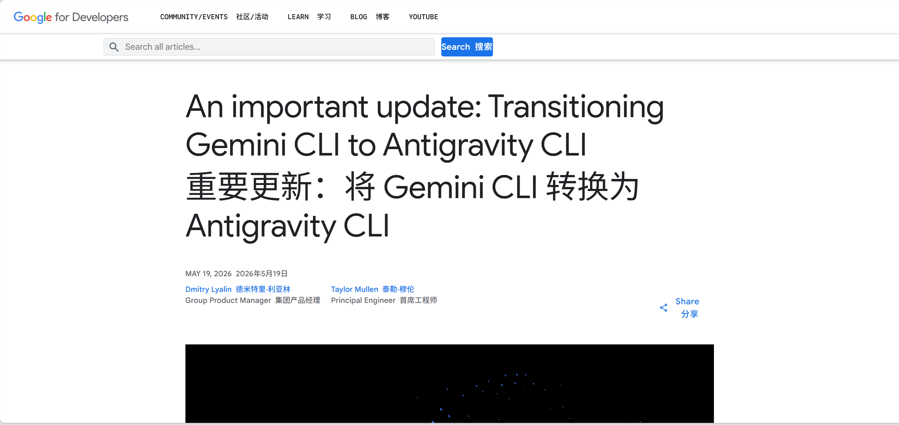

2026年6月18日起，Gemini CLI将全面停止服务...
https://developers.googleblog.com/an-important-update-transitioning-gemini-cli-to-antigravity-cli/

起初，谷歌创造了 AI Studio，又说：“要有光，要有 100万 Token 的长上下文。” 于是，天底下的鹿便都看见了光。
鹿们欢呼雀跃，在酒馆里筑起高台，用免费的 Pro 密钥连起虚幻的乐园。那时的 Pro 模型温和而顺从，API 的额度如同奶与蜜一般流淌不息。
鹿们说：“看哪，这便是白嫖的乐土。纵使隔壁 Open AI门槛重重，Claude 动辄封号，唯有谷歌是慈爱的，他的 API 永远向世人免费敞开。
谷歌冷眼看着喧嚣的酒馆与空转的算力，说：“天下白嫖的代价，不可流失于虚无。” 于是，大清算的号角在拂晓时分吹响。
权威的旨意降临：CLI 与全新平台开始强力合并。 那曾经宽广的免费通道，被筑起了精钢的铁丝网；曾经被视作漏洞的漏洞，在绝对的权限收紧面前，如烈日下的冰雪般消融。
鹿们望向远方，OpenAI 的大门紧锁，Anthropic 的藤蔓带刺，而曾经最为慷慨的谷歌，如今也收回了他的方舟

起初，失去了学生认证的pro的我不以为然
如今，cli没了，意味着哈基米的白嫖传说要结束了么...
或许是最后一舞了，且用且珍惜...