## Zabbix安装
**安装就不多说了，安装官网的手册就可以完成**

[下载Zabbix 7.4 for Debian 13 Trixie(amd64, arm64), MySQL, Nginx](https://www.zabbix.com/cn/download?zabbix=7.4&os_distribution=debian&os_version=13&components=server_frontend_agent&db=mysql&ws=nginx)

## 监控对象主机配置部署

### 环境配置

开一台虚拟机来作为监控对象（这里我是centos9的系统）

**记得要关闭些防火墙什么的**

在zabbix控制台上选择数据采集，主机，添加主机

主机名这里要记住，后面修改文件时，对应的也是hostname

模板就: linux zabbix agent

接口 agent IP是监控对象的ip

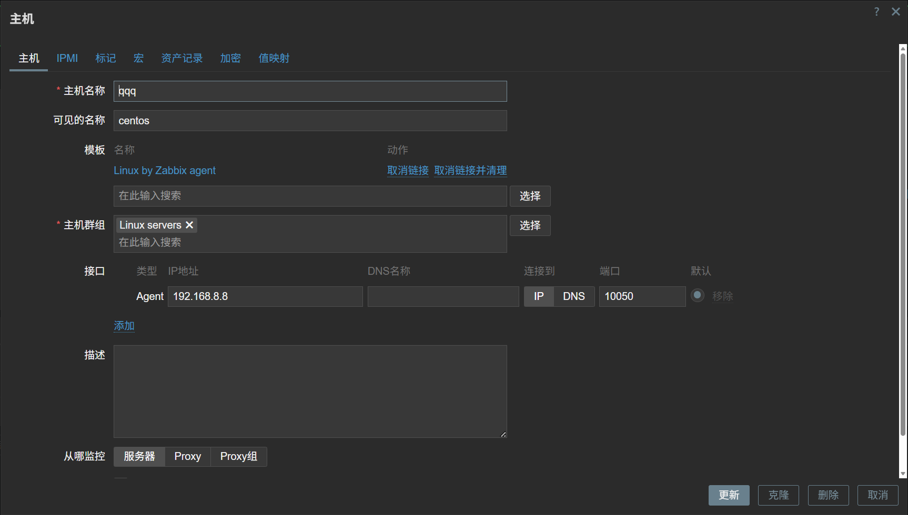

然后也要在centos那里安装监控的agent

https://www.zabbix.com/cn/download?zabbix=7.4&os_distribution=centos&os_version=9&components=agent&db=&ws=

注意：这里也安装官网的安装手册来不过，这次只装agent

### 配置文件
进入配置文件位置里修改
```
 vi /etc/zabbix/zabbix_agentd.conf 
```
一共需要修改的是server的ip(监控者ip)和hostname(主机名)
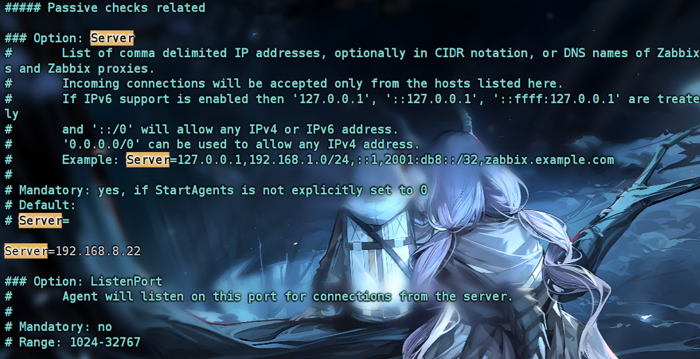

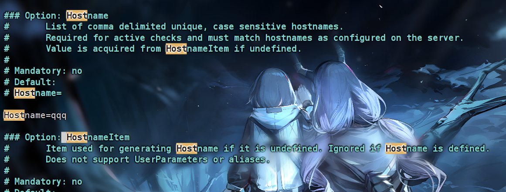

最后重启刷新一下配置
```
sudo systemctl restart zabbix-agent.service 
```
回去控制台就会发现，已经可以开始监控咯

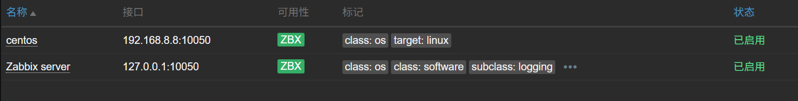

## 监控警报

自带的模板其实已经有监控警报的功能了 

不过我们可以修改触发的条件：

这里修改一下cpu的触发需要的时间

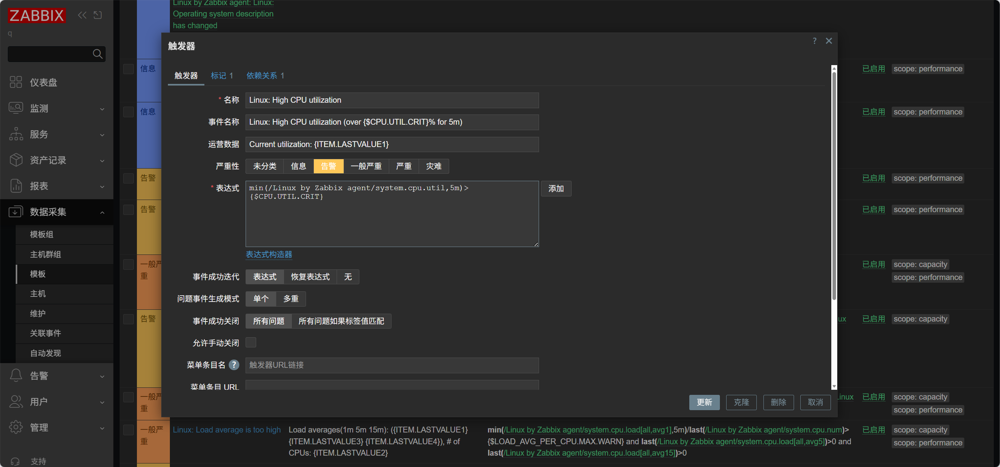

这里改触发阈值

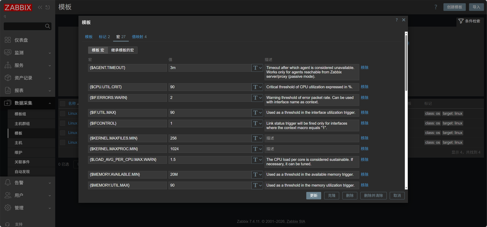

接下来我们来进行压力测试
```
yes > /dev/null &

killall yes         停止测试
```
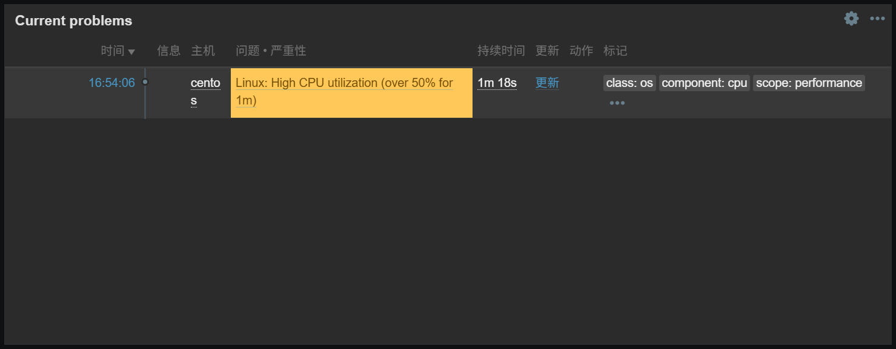

## 设置警报邮箱

先下载个发邮件的工具
```
sudo apt install s-nail -y
```
然后去编辑配置文件
```
vi /etc/s-nail.rc
```
在最下面追加：
```
set v15-compat	兼容
set from="name <mail>"	发件人名称和邮箱
set mta=端口和授权码会因不同的邮箱而不同，具体的自行去网上搜索
set smtp-auth=login	验证模式
set ssl-verify=ignore	忽略本地的证书验证
```
接下来测试一下吧~
```
echo "这里是Arelior~UwU，真正学习Zabbix" | s-nail -s "UwU" arewave@yeah.net
```
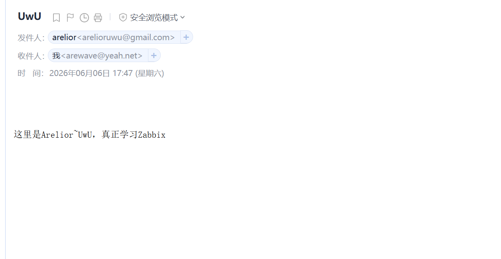

既然邮箱可以使用了，接下来我们就去配置zabbix的告警媒介

可以按照这样的格式配置

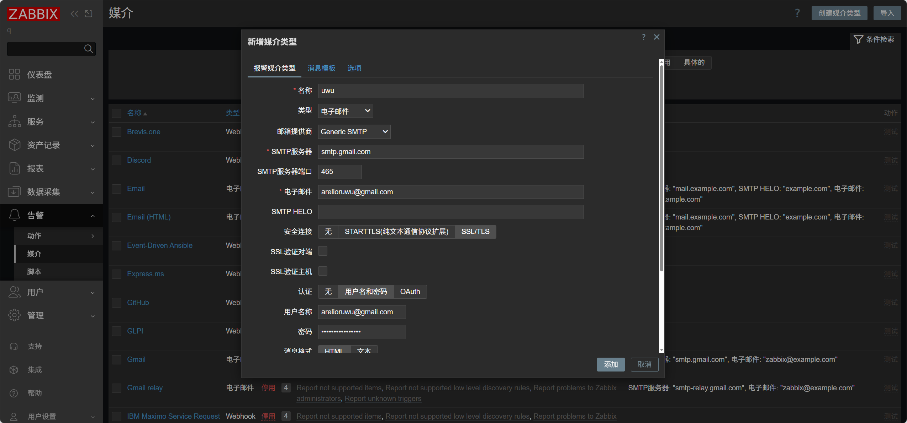

测试一下

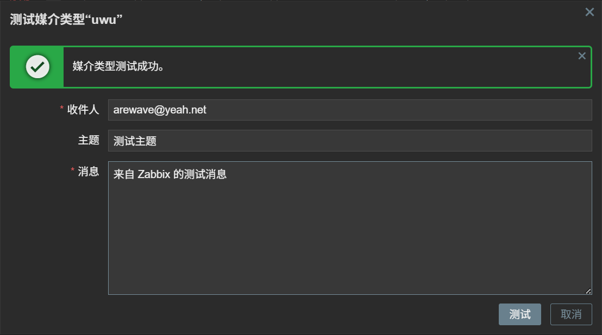

接下来我们添加触发就可以了

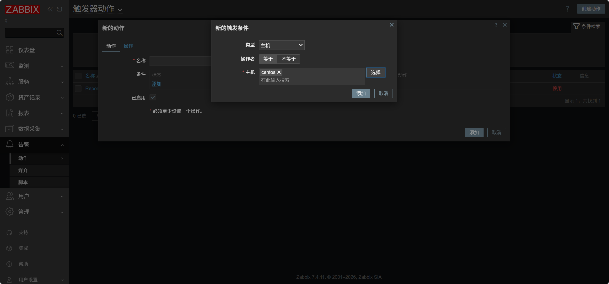

然后在操作那里添加用户

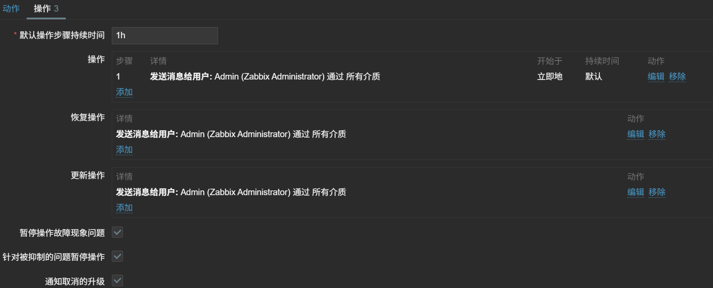

然后我们去用户那里配置收件人邮箱

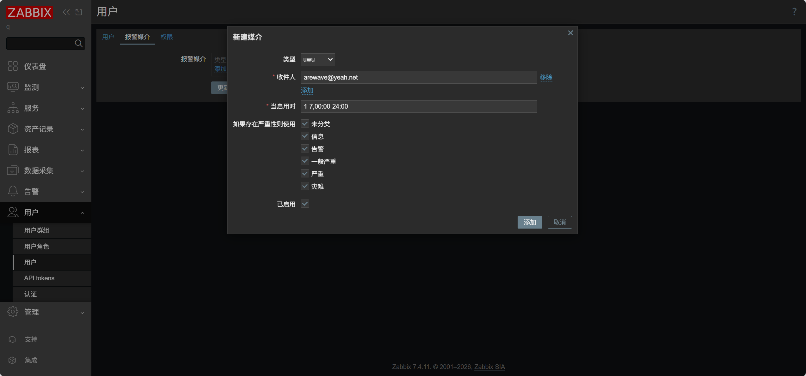

完成后点击更新就可以了

接下来在被监控的主机上进行一次压力测试看看 

已经发邮件来了（内容可以<告警，触发器动作，操作详情>自定义）

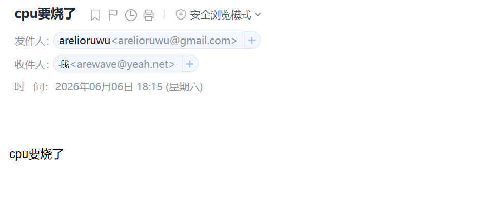