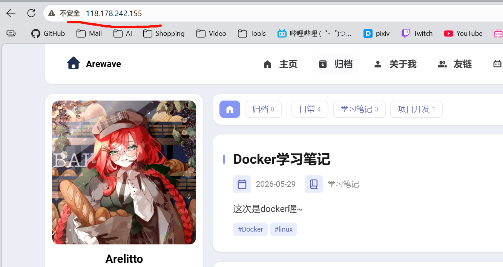

**这次的项目是帮blog解释成静态文件，编辑dockerfile和docker compose，还有nginx配置文件，通过git到远程仓库，在云服务器里git和部署，编辑bash脚本自动更新和巡查服务器**

## 获取博客静态文件-/dist
先是用   pnpm build  来把asrto博客编译成静态网站文件

这时你会发现打开index.html文件会发现显示是有错误的

用pnpm preview 是可以正常显示的

这是因为：

因为 pnpm preview 在你的本地启动了一个微型的 **HTTP 服务器**（比如运行在 http://localhost:4321）。在这个环境下，/ 就代表了你的 dist 文件夹，浏览器也能通过 http:// 协议正常加载和执行所有 JS 代码。

## 编写简单的dockerfile测试

我们在和dist文件同级的地方创建个简单的dockerfile测试一下

**dockerfile  :**

```
FROM nginx:latest

COPY dist /usr/share/nginx/html
```
创建镜像文件：
```
docker build -t blog-test:v0.1 .
```

然后我们配置好端口运行看看
```
PS D:\Project\新建文件夹> docker images                                                               i Info →   U  In Use
IMAGE            ID             DISK USAGE   CONTENT SIZE   EXTRA
blog-test:v0.1   1d4fe1d26908        303MB         91.5MB        
PS D:\Project\新建文件夹> docker run -d --name tset -p 7890:80 blog-test:v0.1
df547bd62e9f50d5f446bebb690f1bb354a82426313ab946cfeef85b6f1b79b0
```
接下来去web看看对接的端口：


测试完了，可以正常运行

要是不行对话先看看日志：docker logs

## 配置nginx.conf文件
### nginx.conf
在Dockerfile同级目录下创建应该nginx.conf文件
```
server {
    listen 80;

    server_name localhost;

    root /usr/share/nginx/html;

    index index.html;

    location / {
        try_files $uri $uri/ /index.html;
    }
}
```
**注释：**
```
location / {
        try_files $uri $uri/ /index.html;
按顺序寻找文件，如果找不到，就把请求统统丢给 index.html 处理。
```
### dockerfile
接下来我们要在dockerfile上面追加我们写的nginx配置文件
```
FROM nginx:alpine

COPY nginx.conf /etc/nginx/conf.d/default.conf

COPY dist /usr/share/nginx/html
```
**注意运行这里的顺序，要是上面的有改动的话，下面的哪怕没有修改过也会重新加载，所以建议把修改频率较低的放在上面，高的放在下面的顺序**

接下来我们把刚刚启动的容器停止了（用不上了，不要占用端口）
```
PS D:\Project\新建文件夹> docker stop df
df
PS D:\Project\新建文件夹> docker ps
CONTAINER ID   IMAGE     COMMAND   CREATED   STATUS    PORTS     NAMES
PS D:\Project\新建文件夹> 
```
重构新的镜像
```
docker build -t test:v2 .
```
```
PS D:\Project\新建文件夹> docker images
                                                                                                                      i Info →   U  In Use
IMAGE            ID             DISK USAGE   CONTENT SIZE   EXTRA
blog-test:v0.1   1d4fe1d26908        303MB         91.5MB    U   
tset:v2          ecdb08d2d017        303MB         91.5MB    U   
```
启动看看
```
docker run -d --name test2 -p 80:80 ecd		注意主机的80端口不要被占用
```

好啦，结束测试，我们暂停容器
```
PS D:\Project\新建文件夹> docker ps       
CONTAINER ID   IMAGE     COMMAND                   CREATED         STATUS         PORTS                                     NAMES
68756344e27a   ecdb      "/docker-entrypoint.…"   3 minutes ago   Up 3 minutes   0.0.0.0:8080->80/tcp, [::]:8080->80/tcp   test2
PS D:\Project\新建文件夹> docker stop 6875
```
## compose文件

### compose.yaml 

有没有发现每次启动都要写一大串（什么端口什么镜像名称的...）

接下来我们写compose文件

创建一个 compose.yaml 文件
```
secrets:
  tset:
    build: .

    ports:
      - "80:80"

    container_name: tset3
    
    restart: unless-stopped
```
注释：
```
restart: unless-stopped 和 restart: always 的区别：
restart: unless-stopped: 如果你手动停止，它不会触发重启，会停止
restart: always：如果你手动停止，它也会自动重启
```
启动
```
docker compose up -d 

发现已经在运行了：
PS D:\Project\test> docker ps 
CONTAINER ID   IMAGE       COMMAND                   CREATED         STATUS              PORTS                                     NAMES
457744b83e32   test-test   "/docker-entrypoint.…"   2 minutes ago   Up About a minute   0.0.0.0:8080->80/tcp, [::]:8080->80/tcp   test3
```
如果启动发现有这样的报错是因为项目的文件夹名称有中文，改成英文的就可以了
```
PS D:\Project\新建文件夹> docker compose up -d
project name must not be empty
What's next:
Debug this Compose error with Gordon → docker ai "help me fix this compose error"
```
后续更新只需要执行：
```
docker compose up -d --build
```
## Git
在本机git上传远程仓库
```
git init	先初始化
git add .	全部添加到暂存区
git commit -m " 提交说明 "	提交到本地仓库
git remot add origin <url>	关联远程仓库
git push --set-upstream origin master	关联主线分支推送给远程仓库
git push	本地仓库推送至远程仓库
```
## 服务器配置
### 从远程仓库拉起配置和文件
第一步是在服务器里检查各种依赖有没有安装（比如git,docker...）

这里我就不多讲述了...环境自己补充和清理（比如端口冲突）

在服务器里运行
```
git clone <远程仓库的url>	拉起远程仓库
```
### 启动！
在项目目录下运行：
```
docker compose up -d --build	需要root权限

docker ps  	查看一下容器运行状态
如果状态是up说明已经可以了，可以去web上看看
注意服务器上的防火墙端口状态
```

**已经部署完成啦~**



## 自动化bash脚本

每次更新都要手动敲一大串命令，我们来编写bash脚本让其自动化吧~

### 更新脚本：

```
vi update
```

```
#! /usr/bin/env bash

echo "正在启动更新~"

echo "-=-=-=-=-=-=-=-=-=-=-=-=-=-=-"

git pull

docker compose down

docker compose up -d --build

echo "更新时间: $(date)" >> updatelog.log

echo "-=-=-=-=-=-=-=-=-=-=-=-=-=-=-"

echo "更新完毕~"
```

```
sudo chomod +x update
```

### 再写一个服务器巡检脚本吧：

```
vi check
```
```
#! /usr/bin/env bash
YELLOW='\033[1;33m'  # 黄色加粗
GREEN='\033[1;32m'   # 绿色加粗
CYAN='\033[1;36m'    # 青色加粗
PURPLE='\033[1;35m'  # 紫色加粗
NC='\033[0m'         # 恢复默认颜色 (No Color)

echo -e "${YELLOW}=== CPU负载 ===${NC}"
printf "${YELLOW}"
uptime
printf "${NC}\n"  
echo ""

echo -e "${GREEN}=== 内存 ===${NC}"
printf "${GREEN}" 
free -h
printf "${NC}\n"
echo ""

echo -e "${CYAN}=== 磁盘 ===${NC}"
printf "${CYAN}" 
df -h
printf "${NC}\n"
echo ""

echo -e "${PURPLE}=== Docker状态 ===${NC}"
printf "${PURPLE}" 
docker ps
printf "${NC}\n"
echo ""
```

```
sudo chmod +x check
```

## 项目涉及的源文件

**GitHub仓库： https://github.com/uArelittou/blogtest**